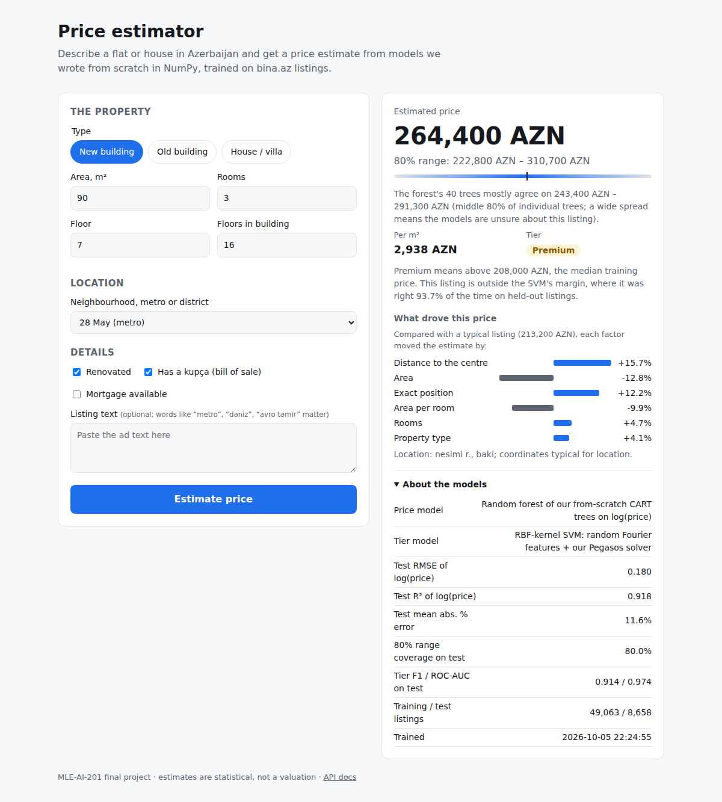

# Decision trees & Pegasos SVMs from scratch — bina.az price prediction

MLE-AI-201 Machine Learning — Final Project (released Sun 04 Oct 2026, **due Sun 18 Oct 2026, 23:59 Baku**).

We implement a **CART decision tree** (Gini / entropy / MSE) and a **soft-margin SVM trained with
Pegasos** (plus a random-Fourier-feature kernel extension) **in NumPy only**, apply them to the
messy bina.az sale-listings dump, and benchmark them honestly against scikit-learn.

| Task | Target | Our models | sklearn baselines (matched settings) |
|------|--------|-----------|-------------------|
| **A — regression** | `log(price)` (AZN) | `DecisionTree(task="regression")` (+ bonus ridge, random forest, gradient boosting) | `DecisionTreeRegressor`, `Ridge`, `RandomForestRegressor`, `GradientBoostingRegressor` |
| **B — classification** | premium vs standard (price > **train** median) | `DecisionTree(task="classification")`, `PegasosSVM`, `RFFPegasosSVM` | `DecisionTreeClassifier`, `SGDClassifier(hinge)`, `LinearSVC`, `SVC(rbf)` |

`python -m src.run_all` reproduces **every** number, table and figure in the report.

---

## Quick start

```bash
python3 -m venv .venv && source .venv/bin/activate      # Python 3.10–3.12 (tested on 3.11)
pip install -r requirements.txt

# 1. get the data (not committed) — see data/README.md
kaggle datasets download -d sehriyarmemmedli/binaaz-sale-project -p data --unzip   # -> data/house_sale.csv

# 2. sanity: unit tests (no dataset needed, ~5 s)
python -m pytest -q

# 3. reproduce everything (~30–40 min on a 4-core laptop; --fast for a 1-minute smoke run)
python -m src.run_all

# 4. build the report and slides (needs a LaTeX install: pdflatex)
make report slides        # -> report/report.pdf, presentation/slides.pdf
```

`make` shortcuts: `make test`, `make fast`, `make all`, `make report`, `make slides`, `make clean`.

### What `run_all` produces

| Output | Content |
|--------|---------|
| console | tidy tables of every headline metric (test + CV mean ± std) |
| `results/metrics.json` | every number (cleaning log, sweeps, selections, CV, test, timings, error analysis) |
| `results/*.csv` | test results, CV results, SVM λ sweep |
| `report/figures/*.pdf` | all figures |
| `report/generated/*.tex` | LaTeX macros + tables that `report.tex` and `slides.tex` `\input` — no hand-typed numbers |

All three output folders are git-ignored: they are regenerated from a clean checkout.

## Results on the real data

From `python -m src.run_all` on `house_sale.csv` (SHA-256 `b6a4c67e0d3c…`): 100,775 raw rows →
57,721 residential listings, split 40,405 / 8,658 / 8,658; premium threshold
208,000 AZN (training median). Full tables, figures and analysis: `report/report.pdf`.

| Model | Task A: test RMSE of log(price) (5-fold CV) | Task B: test F1 (5-fold CV) |
|---|---|---|
| Our decision tree | 0.229 (0.239 ± 0.004) | 0.926 (0.923 ± 0.003) |
| sklearn DecisionTree* | 0.229 | 0.928 |
| Our linear SVM (Pegasos) | – | 0.912 (0.911 ± 0.004) |
| sklearn LinearSVC | – | 0.911 |
| Our RBF SVM (RFF + Pegasos) | – | 0.914 |
| sklearn SVC (RBF) | – | 0.918 |
| Our ridge (bonus) | 0.237 | – |
| Our random forest (bonus) | 0.180 (sklearn 0.181) | 0.945 (sklearn 0.944) |
| Constant baseline (train median) | 0.628 | – |

* Our tree makes the same split as scikit-learn at every node except exact ties and float32 effects
  (0 unexplained differences); averaged Pegasos reaches LIBLINEAR's objective within 0.61%.
* Errors are largest for houses/villas, for districts with few listings, and in both price tails.
  Tier errors concentrate at the boundary: 42% of the tree's misclassifications are listings
  priced within ±10% of the threshold, a band holding only 11% of test listings.

---

## Repository layout

```
.
├── README.md                 # this file
├── requirements.txt          # pinned versions
├── Makefile                  # test / fast / all / report / slides
├── contribution_report.md    # who did what (kept in repo root)
├── data/                     # dataset goes here (git-ignored, see data/README.md)
├── src/                      # ── OUR CODE ──
│   ├── config.py             #   every constant, rule and grid in one place (SEED = 42)
│   ├── data_prep.py          #   parsing, cleaning, features, leakage-free Preprocessor, split, tier label
│   ├── decision_tree.py      #   DecisionTree (Gini / entropy / MSE), from scratch
│   ├── svm.py                #   PegasosSVM, RandomFourierFeatures, RFFPegasosSVM, from scratch
│   ├── evaluate.py           #   metrics from scratch (RMSE … ROC-AUC, PR-AUC), bootstrap, tables
│   ├── tree_compare.py       #   node-by-node comparison of our tree with sklearn's
│   ├── linear.py             #   bonus: ridge via normal equations
│   ├── ensemble.py           #   bonus: random forest + gradient boosting from OUR trees
│   ├── clustering.py         #   bonus: k-means++ and PCA from scratch
│   ├── experiments.py        #   the study / selection / test / CV / analysis stages
│   ├── plots.py              #   every figure
│   ├── reporting.py          #   json / csv / LaTeX writers
│   └── run_all.py            #   ONE command reproduces everything
├── app/                      # web interface: serving model, FastAPI app, static page (see below)
├── tests/                    # pytest: models vs sklearn, metrics vs sklearn, parsing, splits, pipeline
│   └── fake_binaaz.py        #   SYNTHETIC bina.az-shaped data for tests/CI only (never for results)
├── report/                   # IEEE two-column report (self-contained, no IEEEtran.cls)
│   ├── report.tex
│   ├── figures/              #   generated
│   └── generated/            #   generated
└── presentation/             # Beamer slides -> slides.pdf
    └── slides.tex
```

**Golden rule:** the tree, the SVM, the metrics and every bonus model are our own NumPy code.
scikit-learn appears only in the baselines (`src/experiments.py`), the bonus comparisons and the tests.

---

## Method in one screen

**Data (`src/data_prep.py`).** Azerbaijani column names are transliterated and mapped
(`Sahə → area`, `Otaq sayı → rooms`, `Mərtəbə → floor/total_floors`, `Torpaq sahəsi → land`,
`Təmir/İpoteka/Çıxarış → repair/mortgage/bill_of_sale`, `Kateqoriya`, `Binanın növü`, …).
Strings such as `"85 m²"`, `"5 / 9"`, `"1 250 000"`, `"6 sot"` are parsed; prices are converted to AZN
at fixed rates (USD peg 1.70). Rows without price/area, exact duplicates and re-posts are removed;
fixed domain rules (in `config.py`) drop typos. **Leakage:** `unit_price`, `total_price` (and any other
`*price*` column) are dropped, as are identifiers/addresses and listing-promotion flags.

**No test peeking.** Everything that *learns* — median imputation, which category levels get a
one-hot column, standardisation, the tier threshold — is fitted on training rows only
(`Preprocessor`, `Standardizer`, `make_tier_label`). Hyperparameters are chosen on the validation
split; final models are refitted on train+val and scored on the test split **once**, with bootstrap
95% CIs. 5-fold CV on train+val (preprocessing refitted inside each fold) gives mean ± std.

**Decision tree (`src/decision_tree.py`).** Exact CART: one `argsort` per node, every threshold of every
feature scored at once via cumulative class counts (Gini/entropy) or cumulative Σy, Σy² (MSE).
Supports `max_depth`, `min_samples_split`, `min_samples_leaf`, `min_impurity_decrease` (sklearn's
weighted definition), `max_features`; `predict_proba` from leaf frequencies; MDI feature importances.
Tests show it makes the **same split with the same gain as sklearn at every node**; the only
differences are exact ties (sklearn breaks them randomly) and sklearn's float32 casting.

**SVM (`src/svm.py`).** Pegasos on the hinge primal with the bias folded in as a constant feature,
mini-batches, η_t = 1/(λt) (also η₀/√t and constant), projection onto ‖w‖ ≤ 1/√λ, and optional
t-weighted iterate averaging. The objective is recorded every epoch; ‖w‖, the margin 2/‖w‖ and the
support vectors (y f(x) ≤ 1) are reported. Non-linear extension: **random Fourier features**
approximating the RBF kernel, followed by the same linear solver. Its objective is compared with
LIBLINEAR's exact optimum.

## Web interface

A small web app lets anyone price a listing with our own models: the
**random forest of our CART trees** for the price (test RMSE 0.180 on log
price) and the **RFF Pegasos SVM** for premium vs standard (test ROC-AUC 0.974).



For each listing it shows the estimated price, an **80% range** (split-conformal,
calibrated on the forest's out-of-bag residuals, so its coverage on the untouched test
split is a real check), the range the forest's individual **trees agree** on,
the premium/standard tier with how reliable the SVM is at that distance from
its margin, and **what drove the price**: the forest's prediction split exactly
into one contribution per factor (tree-path decomposition).

```bash
pip install -r requirements-app.txt
python -m app.train                     # once, ~6 min: writes models/predictor.pkl (git-ignored)
uvicorn app.main:app --port 8000        # open http://localhost:8000  (API docs: /docs)
```

`python -m app.train --fast` builds a small demo bundle in seconds. Hyperparameters
are the ones the full run selected on validation data; the bundle is fitted on
train+val and scored once on test, so the numbers in "About the models" match the report.

**Docker**

```bash
docker build -t binaaz-estimator .
docker run -p 8000:8000 -v "$PWD/models:/app/models:ro" binaaz-estimator
# or: docker compose up --build
```

The image holds the code only; the model bundle is mounted from `models/`.
Behind a TLS-inspecting proxy, add `--secret id=pip_ca,src=/path/to/ca.crt` to the build.

**API**: `POST /api/predict` takes a listing (`category`, `area_m2`, and any of `rooms`,
`floor`, `total_floors`, `land_area_sot`, `location`, `lat`/`lng`, `repair`,
`mortgage`, `bill_of_sale`, `description`); `GET /api/options` lists valid
locations; `GET /api/model` is the model card; `GET /api/health` is for probes.
Inputs are validated with the same domain rules as the cleaning step (422 on bad input).

Code: `app/predictor.py` (serving model), `app/main.py` (FastAPI), `app/static/` (page),
`tests/test_app.py`, CI in `.github/workflows/app.yml` (tests, then builds the image and
queries the running container). Architecture diagram:
[Eraser](https://app.eraser.io/workspace/4zDitvWlu68DfPiy4AyY).

---

## Reproducibility

* Pinned dependencies (`requirements.txt`); `SEED = 42` for every split, shuffle, bootstrap,
  random-feature draw, forest and k-means init (all via explicit `np.random.default_rng`).
* `run_all` records the dataset file name and **SHA-256** in `results/metrics.json` and the report.
* `python -m pytest` (100+ tests) runs without the dataset; CI also runs the full pipeline in
  `--fast` mode on synthetic bina.az-shaped data (`tests/fake_binaaz.py`).

## Tests

```bash
python -m pytest -q                       # all
python -m pytest tests/test_decision_tree.py -q   # tree vs sklearn (tie-aware), hyperparameters, truncation
python -m pytest tests/test_svm.py -q             # Pegasos vs LIBLINEAR objective, margin, SVs, RFF
```

## Submission checklist (one member submits on Moodle)

- [ ] Team names in `report/report.tex` and `presentation/slides.tex` (`\TeamAuthors`)
- [ ] `contribution_report.md` filled in honestly (it is checked against the Git history)
- [ ] AI-assistance statement in the report matches what the team actually did
- [ ] `python -m src.run_all` on the real dataset → `make report slides`
- [ ] Re-read the report text against the final numbers
- [ ] Tag the final commit: `git tag v1.0-final && git push origin v1.0-final`
- [ ] Upload: GitHub link, `report/report.pdf`, `presentation/slides.pdf`
